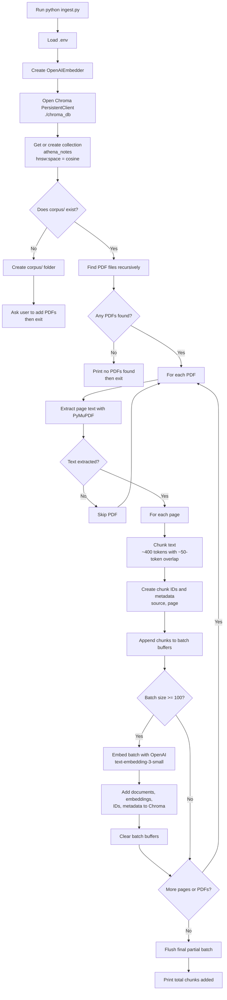
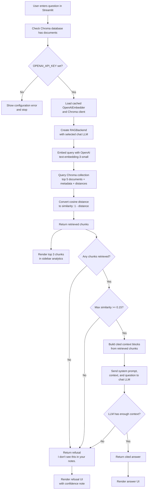

# Athena v0 — Architecture & Design

User-facing setup and troubleshooting live in **[README.md](README.md)**. This document
covers internals and design rationale.

## System Overview

```
PDF Files (corpus/)
    ↓
[ingest.py]
    ├─ Extract text (pymupdf)
    ├─ Chunk text (~400 tokens, 50 overlap)
    └─ Embed in batches (embeddings.py → OpenAI)
    ↓
Chroma DB (./chroma_db/)
    ├─ Persistent vector store
    ├─ Cosine similarity index
    └─ Metadata (source, page)
    ↓
[rag.py] → Retrieve + Generate
    ├─ Embed query (embeddings.py → OpenAI)
    ├─ Retrieve top-k chunks
    ├─ Confidence check (≥ 0.15 similarity)
    └─ LLM generation with citations
    ↓
[app.py] (Streamlit UI)
    ├─ User input
    ├─ Display answer
    └─ Sidebar: context analytics
```

## Feature Flows

### Ingest Flow



### Search Flow



## Component Details

### 1. embeddings.py — Embedding Client

`OpenAIEmbedder` wraps the OpenAI embeddings API behind a `SentenceTransformer`-style
`encode()` so `ingest.py` and `rag.py` stay simple.

- **Model:** `text-embedding-3-small` (1536-dim, L2-normalized vectors).
- **Single or batch:** `encode()` accepts a string (→ one vector) or a list (→ many).
- **Robustness:** empty strings are replaced with a space (OpenAI rejects empties);
  results are sorted by index to stay aligned with the input order.
- **Decoupled from the chat LLM:** the embedder always targets OpenAI using
  `OPENAI_API_KEY` and ignores `LLM_BASE_URL`, so a local chat LLM (which may lack an
  embeddings endpoint) doesn't break retrieval.

### 2. ingest.py — Document Processing Pipeline

**Responsibilities:** walk `corpus/`, extract text page-by-page (`pymupdf`), chunk with
overlap, embed in batches, and store in Chroma with metadata.

**Key functions:**
- `extract_text_from_pdf(pdf_path)` → list of `(text, page_number)` tuples
- `chunk_text_with_overlap(text)` → chunks respecting word/sentence boundaries
- `flush_batch(model, collection, ids, texts, metadatas)` → embeds + inserts one batch
- `ingest_pdfs()` → main orchestrator

**Chunking strategy:**
- Target ~400 tokens (~1600 chars), ~50-token (~200 char) overlap
- Token count approximated as `len(text) // 4`
- Prevents information loss at chunk boundaries

**Batching:** chunks accumulate into buffers and flush in groups of `EMBED_BATCH_SIZE`
(100). A 100-chunk batch is ~40K tokens — well under OpenAI's per-request limits — and
turns thousands of single-chunk calls into a handful of batched ones. Buffers span PDFs,
so a small tail from one file fills up with the next file's chunks.

**Metadata structure:**
```python
{ "source": "lecture-1.pdf", "page": 3 }
```

### 3. rag.py — Retrieval & Generation Backend

**Key class:** `RAGBackend` — encapsulates retrieval and generation.

**Key methods:**
- `retrieve(query, k=5)` → list of `{text, metadata, similarity_score}`
- `generate_answer(query, chunks, threshold=0.15)` → LLM response or refusal

**Similarity scoring:** Chroma returns cosine distance, converted to a `[0, 1]` similarity
by `_distance_to_similarity` as `similarity = 1 - distance`, clamped.
1.0 ≈ identical, 0.0 ≈ unrelated. Both documents and queries use the same normalized
embedding model, so scores are comparable.

**Confidence threshold:**
```python
max_similarity = max(c["similarity_score"] for c in retrieved_chunks)
if max_similarity < 0.15:
    return "I don't see this in your notes."
```

**LLM system prompt:**
```
You are Athena v0, a strict study assistant. Answer the user's question using ONLY
the provided context blocks. Do not invent facts. Every claim you make must be
accompanied by an inline citation format referencing its source file and page,
exactly like this: [filename.pdf p.X]. If the context does not contain enough
information to answer the question, or if you are unsure, reply exactly with:
'I don't see this in your notes.'
```

### 4. app.py — Streamlit Web UI

**Responsibilities:** query input, formatted answers, sidebar context, cached resources.

**Caching with `@st.cache_resource`** — Streamlit re-runs the script on every interaction;
caching keeps the embedder and Chroma client loaded once per session:
```python
@st.cache_resource
def load_embedding_model():
    return OpenAIEmbedder()

@st.cache_resource
def load_chroma_client():
    return chromadb.PersistentClient(path=CHROMA_DB_DIR)
```

**UI elements:** title/description; single-line query input; sidebar LLM-model selector;
sidebar "Retrieved Context Analytics" (top 3 chunks in expanders with score, text, and
source/page); main answer area (blue box for answers, yellow for refusals).

## Data Flow Example — "What is photosynthesis?"

```
1. User input        → "What is photosynthesis?"
2. Embedding         → query embedded via OpenAI (1536-dim) [app.py → rag.py]
3. Retrieval         → Chroma similarity search, top 5 chunks with distances
4. Score conversion  → distances → similarities (e.g. 0.87, 0.76, …, 0.43)
5. Confidence check  → max 0.87 ≥ 0.15 → proceed
6. Context assembly  → build context string with [biology-101.pdf p.5] citations
7. LLM generation    → strict prompt + context + question → cited answer
8. UI rendering      → main: answer; sidebar: top 3 chunks with scores
```

## Key Design Decisions

### 1. OpenAI embeddings (text-embedding-3-small)
✅ High retrieval quality, no local model/torch download, tiny footprint
✅ Same model for documents and queries → consistent vector space
❌ Per-token cost and a network round-trip (mitigated by batching)
**Choice:** quality and zero local-setup outweigh the modest cost.

### 2. Batched ingestion
✅ Far fewer API calls and much faster wall-clock ingestion
✅ Same token cost (billing is per-token, not per-request)
❌ Slightly more buffering logic
**Choice:** essential once embeddings are a network call.

### 3. Persistent Chroma DB
✅ Fast subsequent queries, offline retrieval, no rebuild needed
❌ Single-machine only
**Choice:** ideal for a personal study assistant.

### 4. Similarity threshold (0.15)
✅ Avoids hallucinations; transparent refusals
❌ May refuse some valid lower-scoring matches
**Choice:** conservative default; adjustable per call.

### 5. Strict LLM prompting
✅ Forces citations and refusals
❌ More restrictive than open-ended answers
**Choice:** essential for a study assistant that must not invent facts.

## Performance Characteristics

| Operation | Time | Notes |
|-----------|------|-------|
| Query embedding | ~100–300ms | OpenAI API call |
| Similarity search | ~50–100ms | Chroma index lookup |
| LLM generation | ~2–5s | Dominates query latency |
| Batch ingest (100 chunks) | ~1s | One embedding request |

## Extensibility

```python
# Change embedding model — embeddings.py (delete chroma_db/ and re-ingest)
EMBEDDING_MODEL = "text-embedding-3-large"

# Tune batch size — ingest.py
EMBED_BATCH_SIZE = 200

# Adjust chunking — ingest.py (re-ingest)
CHUNK_TOKEN_SIZE = 600
CHUNK_OVERLAP_TOKENS = 100

# Adjust confidence — rag.py / per call
rag.generate_answer(query, chunks, similarity_threshold=0.3)

# Switch chat LLM — env vars
export LLM_BASE_URL="http://localhost:11434/v1"
export LLM_MODEL="mistral"

# Metadata filtering — rag.py retrieve()
results = self.collection.query(query_embeddings=[...], where={"page": {"$gt": 5}})
```

## Future Enhancements

1. **Reranking** — second-stage rerank of top-k before the LLM
2. **Conversation memory** — multi-turn context
3. **Hybrid search** — semantic + BM25 keyword
4. **Citation verification** — programmatically check cited sources
5. **Multi-collection management** — multiple document sets
6. **FastAPI + React** front end as an alternative to Streamlit

## Security & Privacy

- **PDFs & vectors:** stored locally in `corpus/` and `chroma_db/` (not cloud-synced).
- **Embeddings:** chunk text is sent to OpenAI to be embedded — review OpenAI's data
  policy if your notes are sensitive (this is the main change from a local embedder).
- **Queries:** sent to the configured LLM provider; respect its privacy policy.
- **API keys:** read from `.env` / environment, never committed.

## Testing Strategy

```
1. Empty corpus/      → graceful message
2. Invalid PDF        → skipped, ingestion continues
3. Long document      → chunked correctly
4. Low-similarity query → refusal
5. Multi-page query   → correct citations
6. API error/timeout  → surfaced gracefully
```

---

**Architecture designed for simplicity, transparency, and educational use.** 🏛️
