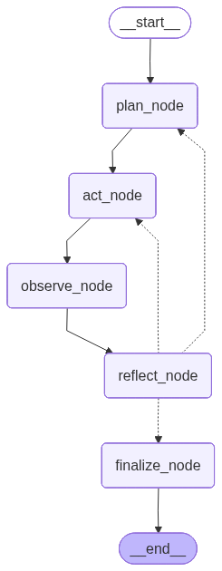

# Athena v0 — RAG Study Assistant

A clean, modular Retrieval-Augmented Generation (RAG) app for querying your own PDF
lecture notes using OpenAI embeddings, Chroma vector search, and an LLM backend.

For internals and design rationale, see **[ARCHITECTURE.md](ARCHITECTURE.md)**.

## Overview

| File | Purpose |
|------|---------|
| `ingest.py` | Reads PDFs from `corpus/`, chunks text (~400 tokens, 50-token overlap), embeds in batches, and stores vectors in Chroma. |
| `embeddings.py` | `OpenAIEmbedder` — wraps the OpenAI embeddings API (`text-embedding-3-small`) behind a simple `encode()` interface. |
| `rag.py` | Retrieves relevant chunks and generates an LLM answer with a strict, citation-enforcing prompt and a confidence threshold. |
| `app.py` | Streamlit web UI with sidebar analytics (retrieved chunks + similarity scores). |

## Key Features

- **Cloud embeddings** — OpenAI `text-embedding-3-small` (1536-dim) for both documents and queries.
- **Batched ingestion** — chunks are embedded/inserted in batches of 100, minimizing API round-trips.
- **Smart chunking** — ~400 tokens per chunk with ~50-token overlap, respecting word/sentence boundaries.
- **Confidence-based refusal** — if max similarity < 15%, replies *"I don't see this in your notes."*
- **Transparent retrieval** — sidebar shows the top retrieved chunks with scores and source/page.
- **Strict prompting** — answers only from context, with inline `[filename.pdf p.X]` citations.

## Installation

```bash
cd Athena.V0
pip install -r requirements.txt
```

Requirements: Python 3.12+, an OpenAI API key.

Create a `.env` file in the project root:

```bash
OPENAI_API_KEY="sk-..."
# Optional — point the chat LLM at a local endpoint (embeddings always use OpenAI):
# LLM_BASE_URL="http://localhost:11434/v1"
# LLM_MODEL="llama3"
```

> **Note:** `OPENAI_API_KEY` is always required — embeddings go to OpenAI even when the
> chat LLM points at a local endpoint via `LLM_BASE_URL`.

## Quick Start

### 1. Add your PDFs

```
Athena.V0/
├── ingest.py
├── rag.py
├── app.py
└── corpus/
    ├── lecture-1.pdf
    └── notes.pdf
```

### 2. Ingest (one-time)

```bash
python ingest.py
```

```
Initializing OpenAI embedder...
Initializing Chroma persistent client at ./chroma_db...

Processing: lecture-1.pdf
  Page 1: 5 chunks prepared
  ...
✓ Ingestion complete! Total chunks added: 127
```

### 3. Run the app

```bash
streamlit run app.py
```

Opens at **http://localhost:8501/**. Type a question, read the answer, and inspect the
retrieved context in the sidebar.

## Configuration

### Environment variables

| Variable | Description | Default |
|----------|-------------|---------|
| `OPENAI_API_KEY` | OpenAI key — required (embeddings + default LLM) | — |
| `LLM_BASE_URL` | Base URL for a local/OpenAI-compatible chat LLM (e.g. Ollama) | — |
| `LLM_MODEL` | Chat LLM model name | `gpt-4o-mini` |

### Code constants

```python
# ingest.py
CHUNK_TOKEN_SIZE = 400        # chunk size in tokens
CHUNK_OVERLAP_TOKENS = 50     # overlap in tokens
EMBED_BATCH_SIZE = 100        # chunks per embedding request

# rag.py
SIMILARITY_THRESHOLD = 0.15   # min confidence to answer (0–1)

# embeddings.py
EMBEDDING_MODEL = "text-embedding-3-small"
```

Changing the embedding model or chunking requires deleting `./chroma_db/` and
re-running `python ingest.py` (vector dimensions must stay consistent).

## Cost

`text-embedding-3-small` is ~$0.02 per 1M tokens. Embedding a typical notes corpus
costs a few cents; each query embeds one short string. The chat LLM is billed separately.

## Athena v3 - Week 7 Planning Agent

Athena v3 adds a manual research-agent loop on top of the preserved v1/v2 RAG
stack. It does not introduce LangGraph, CrewAI, AutoGen, or another agent
framework.

### Architecture

```text
Question
  |
  v
PLAN                v3/planner.py
  |
  v
ACT                 v3/actor.py
  |
  v
OBSERVE             v3/observer.py + v3/tools.py
  |
  v
REFLECT             v3/reflector.py
  |
  +---- continue / replan ----+
  |                            |
  +---------- done ------------+
               |
               v
Final Answer    v3/research_agent.py
```

The loop is capped at 8 iterations. Each action chooses one of
`search_notes`, `web_search`, or `done`. `search_notes` reuses the existing v2
Chroma/LangChain vector store. If embedding search is unavailable, it falls back
to a local keyword pass over the same Chroma documents. `web_search` uses
OpenAI's hosted web-search tool when available and records an explicit failure
observation when live search cannot run.

### Trajectory

`v3/trajectory.py` defines the Pydantic models used by the loop:

- `Plan`: ordered steps plus rationale.
- `ActionDecision`: selected tool, arguments, and reasoning.
- `ReflectDecision`: continue, replan, or done, with optional replacement plan.
- `Trajectory`: current iteration, question, current plan, compressed notes,
  recent observations, completed steps, and separated note/web sources.

`Trajectory.observations` stores only the most recent two raw tool outputs.
Older evidence is compressed into `Trajectory.notes`, preventing prompt context
from growing unbounded.

### Reflection

Reflection inspects only the current plan, compressed notes, recent observations,
and completed steps. It can continue, terminate early, or replan. The ablation
entry point `query_athena_v3_no_reflection()` disables this stage so evaluation
can compare reflection-on and reflection-off behavior.

### Trajectory Logging

Each v3 run writes replayable JSONL events to `trajectories/<timestamp>.jsonl`.
Generated logs are ignored by git; `trajectories/.gitkeep` keeps the directory
available.

Collapsed sample:

```json
{
  "timestamp": "2026-07-09T13:56:55Z",
  "iteration": 1,
  "current_plan": {"steps": ["Search Athena notes", "Synthesize answer"], "rationale": "..."},
  "chosen_action": {"tool": "search_notes", "args": {"query": "Who founded Synchron?"}, "reasoning": "..."},
  "tool": "search_notes",
  "tool_arguments": {"query": "Who founded Synchron?"},
  "tool_result_summary": "search_notes found Thomas Oxley in the Synchron notes...",
  "reflection": {"decision": "done", "reasoning": "Enough note evidence was gathered.", "new_plan": null},
  "notes": "Synchron was founded by Thomas Oxley [Startup Deep Dive_ Synchron.pdf p.1].",
  "completed_steps": ["search_notes: ..."]
}
```

### Evaluation

The existing Week 5 harness is extended rather than replaced:

```bash
.venv\Scripts\python.exe evals\run.py --version wk5 --skip-langsmith
.venv\Scripts\python.exe evals\run.py --version wk7 --skip-langsmith
.venv\Scripts\python.exe evals\run.py --version wk7_no_reflection --skip-langsmith
```

Saved results from `evals/results_wk5.json` / `evals/results_wk7.json` /
`evals/results_wk8.json`:

| Version | Rigid | Judge | Total | Average Iterations | Iteration Distribution |
|---------|------:|------:|------:|-------------------:|------------------------|
| Week 5 / v2 | 86.7% | 93.3% | 90.0% | n/a | n/a |
| Week 7 / v3 (hand-rolled loop) | 72.2% | 100.0% | 86.1% | 2.11 | {1: 9, 2: 5, 3: 2, 6: 1, 7: 1} |
| Week 8 / v4 (LangGraph) | 72.2% | 100.0% | 86.1% | 2.39 | {1: 8, 2: 4, 3: 3, 5: 2, 8: 1} |

Week 8 matches Week 7's total exactly, including an identical per-category
breakdown (`in my notes`: 50.0%, `needs web search`: 100.0%, `not in my
notes`: 100.0%) — the LangGraph rebuild preserves v3's plan/act/observe/
reflect behavior rather than regressing it (v4's `finalize_node` reuses
`v3.research_agent.final_answer()` verbatim, so both versions produce the
same answer shape and are scored by the same evaluators). The iteration
distribution differs slightly because v4 always runs one extra `reflect`
step after the actor volunteers "done" (see [v4/DESIGN.md](v4/DESIGN.md),
"done handling"), which shifts some iteration counts up by one compared to
v3's early-break loop.

Run the Week 8 eval with:

```bash
.venv\Scripts\python.exe evals\run.py --version wk8 --skip-langsmith
```

### Known Limitations

- Live web search depends on the configured OpenAI model supporting hosted web
  search tools.
- When network/API access is unavailable, v3 falls back to bounded local notes
  search and explicit failure observations for web search.
- The repository did not contain pre-existing `search_notes`, `web_search`, or
  Instructor modules, so v3 adds thin wrappers while reusing the existing v2
  retrieval stack where possible.
- The reflection performance claim requires running both `wk7` and
  `wk7_no_reflection` with live model access.

## Athena v4 - Week 8 LangGraph Agent

Athena v4 rebuilds v3's hand-rolled plan/act/observe/reflect loop as a
`langgraph.graph.StateGraph`, additively (v1/v2/v3 are untouched) and reusing
v3's Pydantic models and tool wrappers rather than forking them. Full design
rationale — the node/edge mapping, every `AthenaState` field and its reducer,
and the deliberate behavior differences from v3 — is in
[v4/DESIGN.md](v4/DESIGN.md).



Only `reflect_node` fans out via a conditional edge (`route_after_reflect`,
mirroring v3's continue/replan/done decision); every other edge is fixed.
The compiled graph is checkpointed with `SqliteSaver` (`v4/checkpoints.db`)
and compiled with `interrupt_before=["finalize_node"]`, so every run pauses
before the final answer is synthesized and shows the accumulated research
notes as a draft brief for human approval.

### Running it

```bash
uv run streamlit run v4/app.py
```

The UI streams live per-node progress (`graph.stream(..., stream_mode=
"updates")`), then pauses before `finalize_node` with Approve / Reject
controls — Approve resumes normally; Reject re-routes to `plan_node` with
your feedback folded into the next planning prompt.

Regenerate the graph diagram above with:

```bash
make graph
```

(`draw_mermaid_png()` renders via the remote Mermaid.ink API, so no local
Graphviz install is required — see v4/DESIGN.md, "Graph visualization".)

### Resumability

Because every node boundary is a SqliteSaver checkpoint, a process killed
mid-run resumes from its last completed node on restart, against the same
`thread_id` and `v4/checkpoints.db` file, rather than starting over. See
[v4/demo_resume.md](v4/demo_resume.md) for a reproducible kill/restart demo
(best captured as a short screen recording).

## Troubleshooting

| Issue | Fix |
|-------|-----|
| "No PDF files found in corpus/" | Create `corpus/` and add PDFs, then re-run `python ingest.py`. |
| "OPENAI_API_KEY is not set" | Add it to `.env` (required even with a local chat LLM). |
| "No documents found in the database" | Run `python ingest.py`. |
| Dimension/embedding mismatch | Delete `./chroma_db/` and re-ingest. |
| Slow / timing-out answers | Check network and OpenAI rate limits, or use a local LLM via `LLM_BASE_URL`. |

---

**Happy studying with Athena v0!** 🏛️✨
